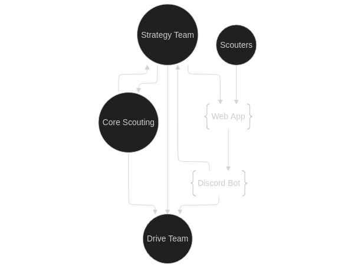

# turbo-scout


Team 2530's scouting system.

## Components

| Name      | Path              | Purpose                                                                                           |
| --------- | ----------------- | ------------------------------------------------------------------------------------------------- |
| Frontend  | `turbo-scout/`    | The primary frontend for turbo-scout. Used by scouters to enter information.                      |
| Discord   | `turbo-discord/`  | A backend for turbo-scout that uses discord for data storage and viewing.                         |
| QR Server | `turbo_qr.py`     | The QR code scanner. This is only meant to be used as a last resort if everything else breaks.    |
| config.yml | `config.yml` | A single config file for the entire system. |

## Flow Chart



## Usage

### Setting up the backend

You can tell if the backend is working by checking the status of the Turbo Scout bot on discord. If it is online, and the bot says it is "watching everything" than the backend is running like usual. If it is offline, then the backend is not online.

You will need some kind of computer with internet access to run the backend on. Such a computer **does not need to be at the event**, because you should try to become familiar with using SSH to control it remotely. It can be at the event, but just keep in mind that it doesn't have to be.

To start the backend on a new machine, perform the following steps:

1. Install Java

2. Clone the repository and move into the correct folder

    You can do this on Linux with the following commands:

    ```bash
    git clone https://github.com/Team2530/turbo-scout.git
    cd turbo-scout/turbo-discord
    ```

3. Setup for the season/event

    If the code in github is not already prepared for the season and event you are starting the backend for, you will need to modify the code so that it is. Refer to the [following](#updating-question-list) [sections](#setting-up-turbo-scout-for-an-event) to setup the code for the correct event and season.

4. Get access to the `.env` file

    This contains the discord bot token, and is required for authenticating the backend.

    After you have received the file, simply move it to the `turbo-discord` folder and everything will work as intended.

5. Do a test run of the backend

    You can make sure that the backend works properly if running `./gradlew run` starts the server and the discord bot becomes online. Use CTRL-C to stop the server after verifying that it works.

6. Start the server for real

    You need the server to continue running after you close the terminal window (or SSH session) that you start the server from. There are several ways to do this, but this is probably the simplest:

    ```bash
    nohup ./gradlew run &
    ```

    Using this command instead of the normal `./gradlew run` will work as intended.

    You could also use a terminal multiplexer like [tmux](https://github.com/tmux/tmux/wiki) or something more sophisticated, but this method works just fine and requires less setup.

### Updating question list

NOTE: **PLEASE** don't do this in the middle of a competition. It makes the data inconsistent and might cause problems. 

To update the question list, you need to modify two files found in `turbo-scout/turbo-scout/src/config/` called `pit.json` and `match.json`. As their names imply, these JSON[^1] config files control the questions for pit scouting and match scouting respectively.

[^1]: JSON stands for **J**ava**S**cript **O**bject **N**otation. You can learn more about JSON files [here](https://www.w3schools.com/js/js_json_intro.asp).

#### Questions

A single question might look something like this:

```json
{
    "id": "general.drivetrain",
    "label": "What drivetrain are they using?",
    "type": "select",
    "options": [
        "Tank",
        "West Coast",
        "Mecanum",
        "Omni",
        "Swerve",
        "Other"
    ]
},
```

The fields of this object are as follows:

- `id`: The `id` field specified what name the answers from this question will be stored of internally in turbo scout. Make this something shorter than the `label`, but still something you recognize and correlate with the question `label`.
- `label`: The `label` field is what the scouter will see when they are entering this question.
- `type`: The `type` of the question defines what type of form element will be shown to the user. In this instance, it has a type of `select`, which is just a dropdown menu. You can find a list of the available form element types [here](https://github.com/Team2530/turbo-scout/blob/main/turbo-scout/src/form.tsx#L80) in `form.tsx` or implement some new ones.
- `options`: The `options` field is specific to questions with a type of `select`, and it defines the options that the user can choose from. 

### Setting up turbo scout for an event

1. Get the blue alliance event code

    This can be found on the blue alliance page for the event in the URL. For example, the event code for the [2024 Curie Division](https://www.thebluealliance.com/event/2024cur) at worlds is 2024cur. Notice how the last part of the blue alliance URL \(/event/2024cur\) is the event code.

    In some cases, an event is not in the blue alliance. In this case, feel free to make up your own temporary event code just to keep things organized.

2. Change all the event codes for the new event.

    You will need to update `config.yml` and a few java files in the `turbo-discord` backend.

3. Get a list of scouters that will be at the event

    You can sort them alphabetically if you want, and feel free to place members of the team in Core Scouting at the very top of the list as they will be using it the most.

    Don't include middle or last names unless there is a name conflict. If there is a name conflict, either use the first letter of their last names as well or use nicknames after asking for permission. 

    Save this information in `config.yml`.

4. Commit your changes

    The `setup.py` github action will automatically do everything else for you.